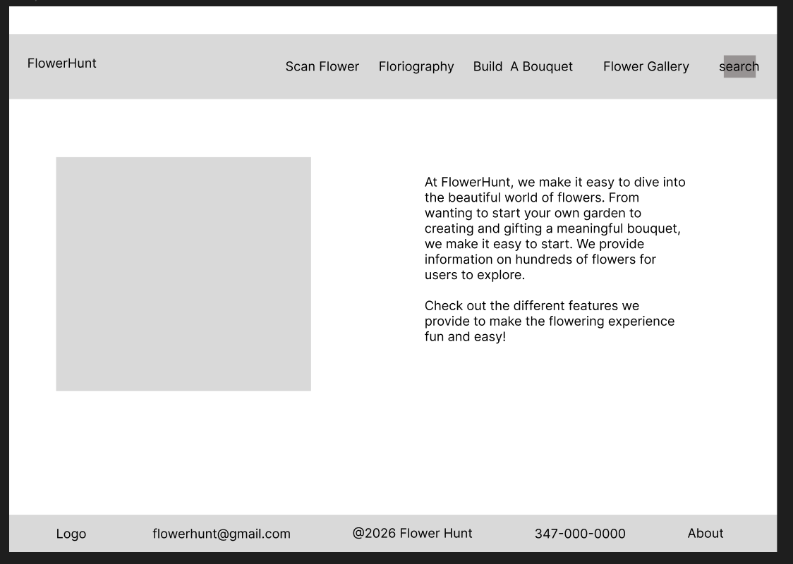

# Wireframes

Reference the Creating an Entity Relationship Diagram final project guide in the course portal for more information about how to complete this deliverable.

## List of Pages

[👉🏾👉🏾👉🏾 List the pages you expect to have in your app, with a ⭐ next to pages you have wireframed]
[⭐]Home Page
[⭐]flower dictionary
[]Individual Flower Pages
[]Individual Flower Gallery 
[]Scan a Flower Page 
[]Flower Search result page
[]Grow guide page
[]Build a Bouquet page
[⭐]About page

## Wireframe 1: [Home Page]

[]

## Wireframe 2: [Individual Flower page]

[]

## Wireframe 3: [About Page]
[]

[👉🏾👉🏾👉🏾 include more wireframes as desired]
